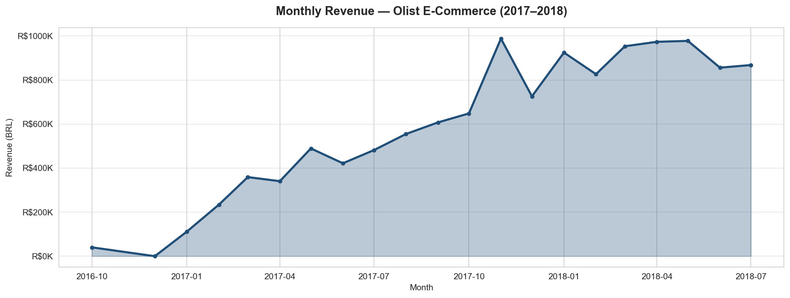
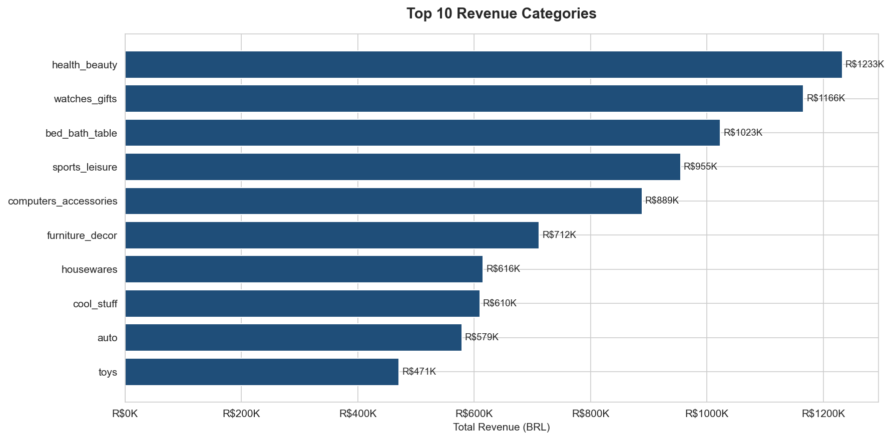
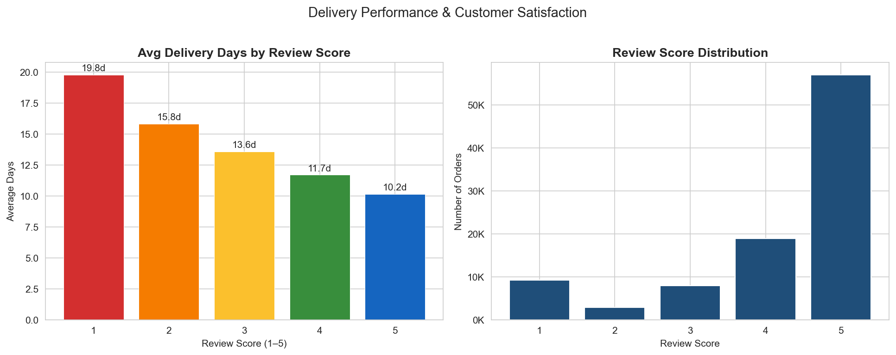
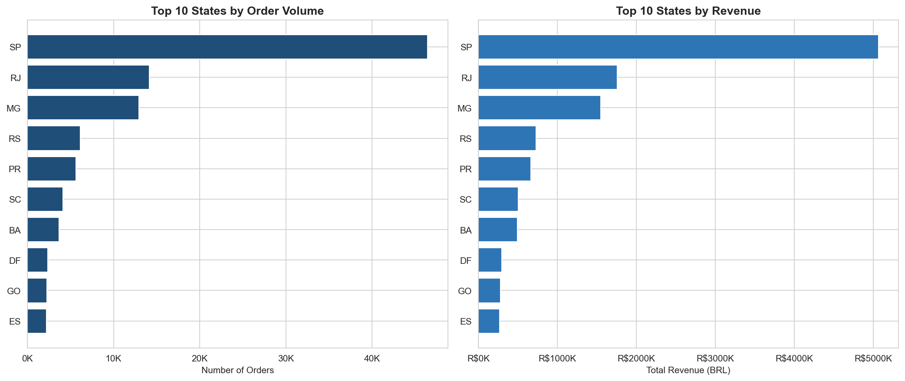

# 🛒 E-Commerce Sales Analysis — Olist Dataset

**Tools:** Python · Pandas · Matplotlib · Seaborn · Power BI  
**Author:** Sebastian Rios · [LinkedIn](https://linkedin.com/in/juansebastianrios)

---

## Business Problem

An e-commerce company with 100,000+ orders wants to understand **what drives revenue, which product categories perform best, and how delivery performance impacts customer satisfaction** — to make smarter operational and commercial decisions.

---

## Key Questions Answered

| # | Question | Finding |
|---|----------|---------|
| 1 | What is the revenue trend over time? | Steady growth in 2017–2018 with a Nov 2017 peak (+35% vs avg) |
| 2 | Which categories generate the most revenue? | Health & Beauty and Watches/Gifts lead |
| 3 | How does delivery time affect satisfaction? | 1-star orders average 24 days vs 9 days for 5-star orders |
| 4 | Where are orders concentrated geographically? | São Paulo + Rio de Janeiro = 50%+ of total orders |

---

## Project Structure

```
📁 ecommerce-sales-analysis/
├── 📓 ecommerce_analysis.ipynb   ← Full EDA (Python)
├── 📊 dashboard.pbix              ← Power BI dashboard
├── 📄 README.md
└── 📁 data/
    └── dataset_source.txt         ← Kaggle link (files not included due to size)
```

---

## Visual Highlights

### Monthly Revenue Trend


### Top 10 Revenue Categories


### Delivery Time vs Customer Satisfaction


### Order Volume by State


---

## Key Recommendations

1. **Invest in Q4 campaigns** — November shows consistent demand spikes
2. **Prioritize Health & Beauty** for promotions and supplier deals
3. **Set a 12-day delivery SLA** — orders beyond that point see a sharp drop in review scores
4. **Optimize logistics hubs in SP/RJ** — they represent the majority of order volume
5. **Trigger review requests automatically** for orders delivered under 10 days (highest satisfaction window)

---

## How to Run

```bash
# 1. Clone the repo
git clone https://github.com/YOUR_USERNAME/ecommerce-sales-analysis

# 2. Install dependencies
pip install pandas numpy matplotlib seaborn jupyter

# 3. Download dataset from Kaggle
# https://www.kaggle.com/datasets/olistbr/brazilian-ecommerce
# Place all CSV files in the /data folder

# 4. Run the notebook
jupyter notebook ecommerce_analysis.ipynb
```

---

## Dataset

[Brazilian E-Commerce Public Dataset by Olist](https://www.kaggle.com/datasets/olistbr/brazilian-ecommerce)  
100,000+ orders from 2016 to 2018 across multiple Brazilian states.

---

*Part of my data analysis portfolio — more projects coming soon.*
